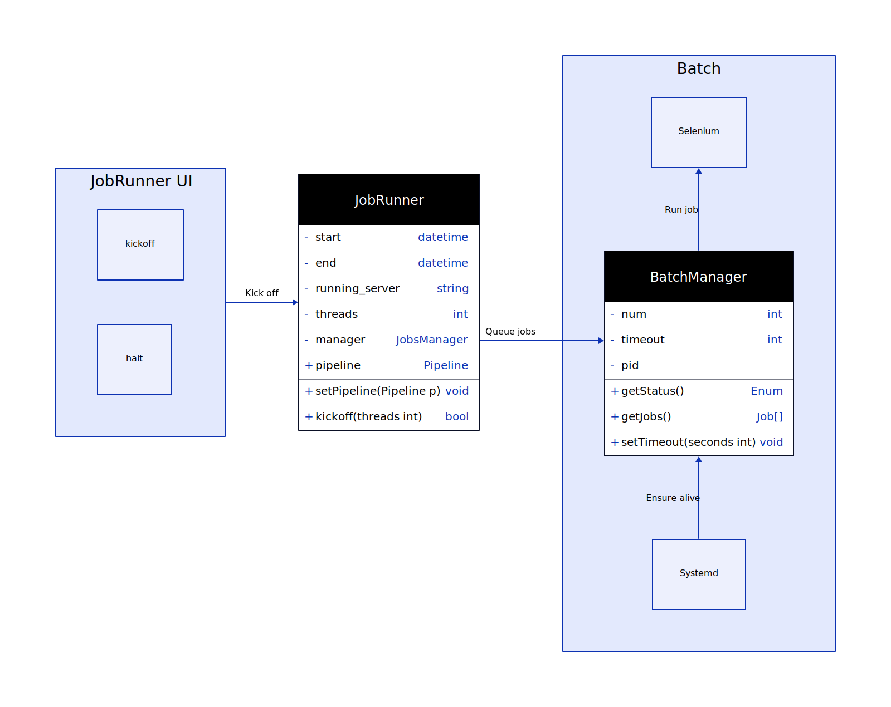
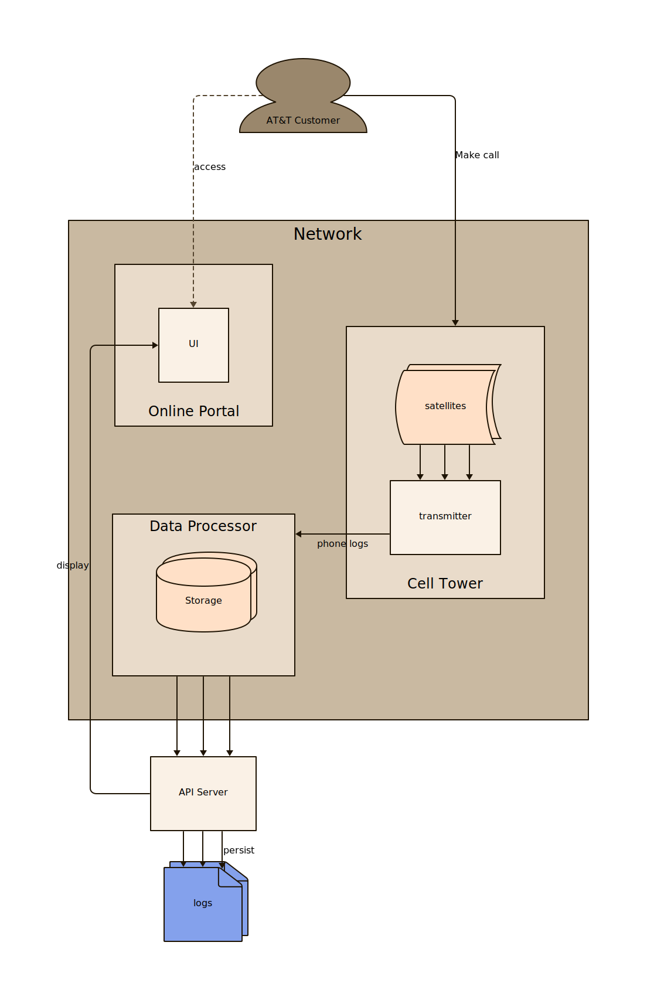
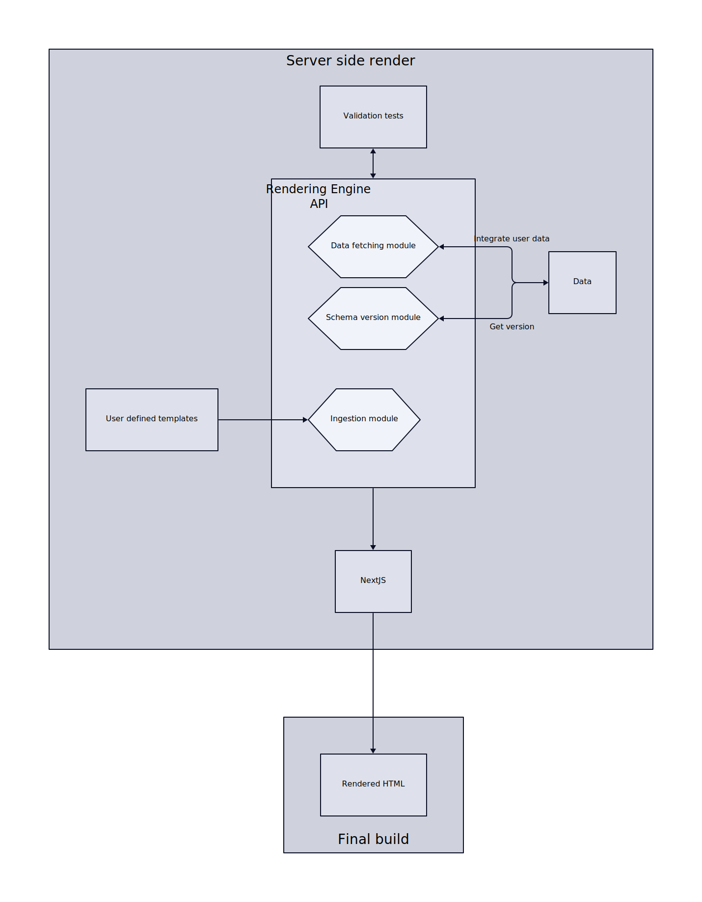
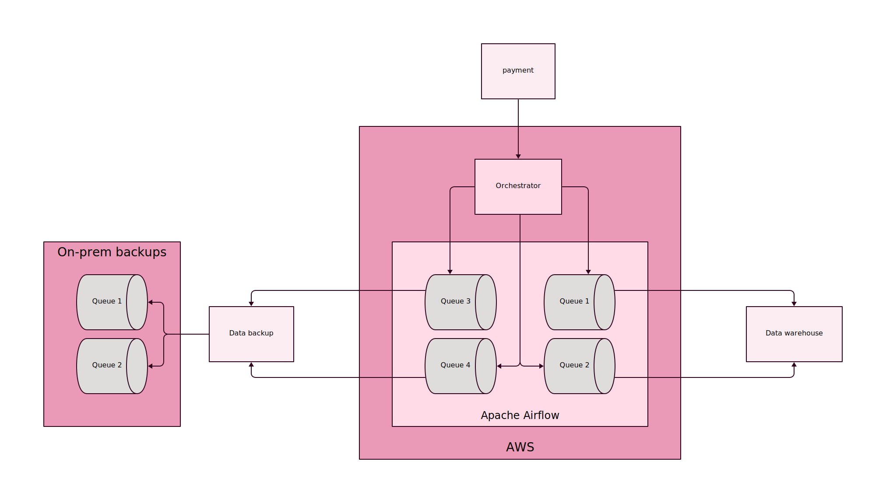
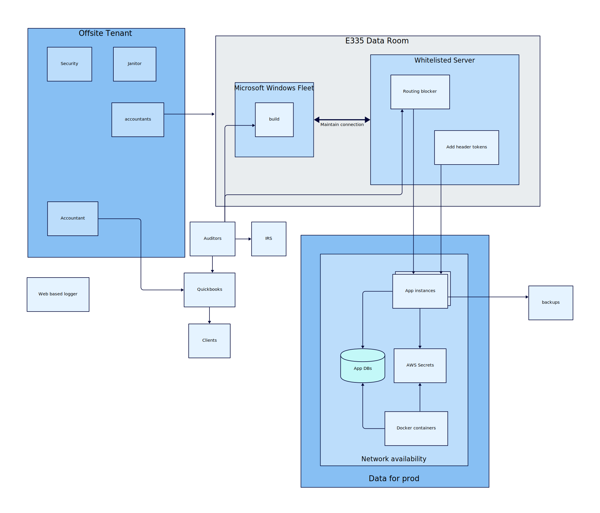
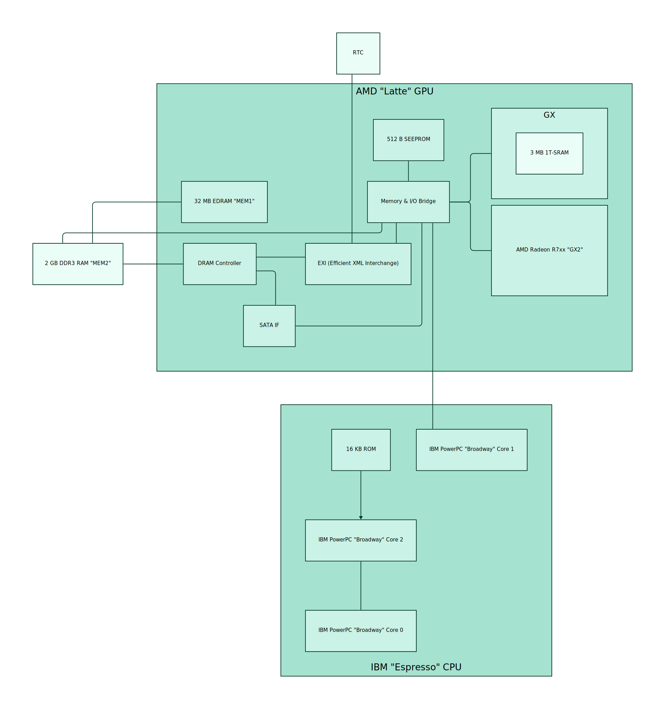

<div align="center">
  
  <h1>
    TALA
  </h1>
 </div>


TALA is a diagram layout engine designed specifically for software architecture diagrams,
though it works well in other domains too. TALA is closed-source. This repository is
primarily for installation instructions. You can also use this repository to report
issues, ask questions, and request features.

To learn more about TALA, please visit
[https://terrastruct.com/tala](https://terrastruct.com/tala).

To compare TALA with other layout engines, please visit
[https://text-to-diagram.com](https://text-to-diagram.com/?a=d2&layout_a=tala&b=d2&layout_b=dagre&example=chess).

[User Manual (PDF)](https://github.com/terrastruct/TALA/raw/master/TALA_User_Manual_v0.2.13.pdf)

## Rendering samples

You can see the `.d2` text for these in [./docs/d2](./docs/d2). Samples are
[generated](./ci/generate_samples.sh) through the CLI.

||||
|:-------------------------:|:-------------------------:|:-------------------------:|
||||

## Installation

### Install script

The most convenient way to install is through the install script.

```sh
# With --dry-run the install script will print the commands it will use
# to install without actually installing so you know what it's going to do.
curl -fsSL https://d2lang.com/install.sh | sh -s -- --tala --dry-run
# If things look good, install for real.
curl -fsSL https://d2lang.com/install.sh | sh -s -- --tala
```

You can also find binaries [Releases](https://github.com/terrastruct/TALA/releases) page
for Linux, MacOS and Windows, for both AMD and ARM. Download the appropriate one for your
OS to a directory in your path.

### macOS (Homebrew)

If you're on macOS, you can alternatively install with `brew`. (the install script above
does this automatically if you have `brew` installed).

```sh
brew install terrastruct/tap/tala
```

### Post-install

Check that it was installed properly:

```sh
d2 layout tala
```

It should print out information about TALA. If not, please see troubleshooting steps.

### Use TALA

You are now ready to use TALA to layout your diagrams! Specify that D2 should use TALA by
setting the environment variable `D2_LAYOUT`.

```sh
D2_LAYOUT=tala d2 in.d2 out.svg
```

### Seeds

Optimal placements of nodes that minimizes distance and crossings is an NP-hard problem.
TALA searches with heuristics to get an approximation. This search space has some
randomness at each step. Choosing a different seed for this randomness can have signficant
impact on the overall layout, as it may converge on an entirely different one.

For advanced usage of TALA, you may specify the seed to get a different layout:

```d2
d2 --layout tala --tala-seed 44 input.d2
```

### Add API token (optional)

You may skip this step if you are just evaluating.

#### As environment variable

If you have an API token, copy and paste it into your environment variables. E.g.

```bash
export TSTRUCT_TOKEN = "tstruct_..."
```

#### As config file

You can also use a JSON file as config. The benefit to this is that when the TALA license
expires and has to renew, it will swap out the key for you automatically in the background
with the updated one.

By default, TALA finds the configuration file at the following path:

`$HOME/.config/tstruct/auth.json`:

```json
{
  "api_token": "tstruct_xxx"
}
```

You can change where this path is by configuring it with the following environment
variable:

```bash
export TSTRUCT_AUTHFILE = /var/local/...
```

## License keys

TALA is freely installable and locally runnable for evaluation. You'll need an API token
from your Terrastruct account to run it out of evaluation mode. Alternatively, if you
don't want to create an account, you can purchase a personal license key for TALA that
allows you to run TALA forever with access to updates for 12 months
[here](https://buy.stripe.com/bIYeXL3cT2Lr23e5ko). If you'd like to get the benefits of a
paid Terrastruct account at any time after, your license key will allow that.

## Troubleshooting

### TALA not found

```sh
which d2plugin-tala
```

If this does not return a directory, then `d2plugin-tala` is not in your path.

```sh
echo $PATH
```

Please move the downloaded binary to one of those locations.

### License warning prints even with API token

In the same terminal that you're running `d2` on, run

```sh
echo $TSTRUCT_TOKEN
```

If it is not found, then your environment variable has not been set in your shell. Make
sure you add it to the appropriate shell config file and `source` it in the running
terminal.

### Other

Please open an Issue describing what you're running into and we're happy to help. If you'd
like to remain anonymous/private, feel free to email us at info@terrastruct.com

## FAQ

### Does TALA use the internet?

The TALA plugin do not collect telemetry or use the internet in any way except to ping to
check the status of a license. This is only done when necessary, e.g. if you purchased a
month subscription, TALA will ping at the start of the next month and renew automatically
if the subscription is ongoing. If you purchased a year, it won't ping for a year. The
  only data that's sent in these pings is the API token itself. No diagrams or anything
  else leaves your computer.

### Others

Full FAQ at [https://terrastruct.com/tala](https://terrastruct.com/tala).
